# 2.5-month-of-intel®-edge-ai

My pledge "2.5 months of Udacity" for the Intel® Edge AI Scholarship Foundation Course Nanodegree Program:\
https://www.udacity.com/scholarships/intel-edge-ai-scholarship
The classroom starts from December 16, 2019 and will End in March 3, 2020.

My pledge "#30DaysofUdacity" with Udacity.
## Day 1: January 18, 2020. #30DaysofUdacity
- I entered the classroom and watched some videos.
- My current progress is:\
  **Part 2. Intel® Edge AI Foundation Course** (Progress 47%)\
  **Lesson 3 - The Model Optimizer** (Progress 47%)\
  **9. Using the Model Optimizer with Caffe Models**
  **Completed lesson 3**
- I encourage @Pawan and @MODF. 

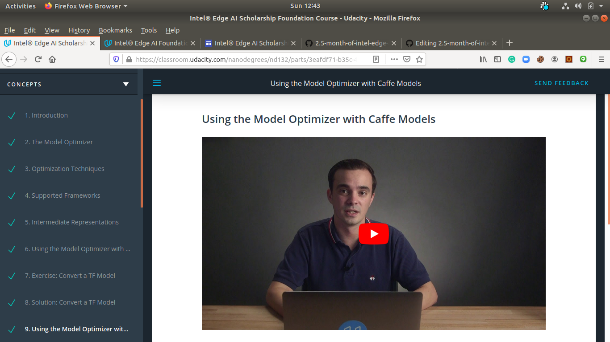

## Day 2: January 19, 2020. #30DaysofUdacity
- My current progress is:\
  **Part 2. Intel® Edge AI Foundation Course** (Progress 77%)\
  **Lesson 4 - The Inference Engine** (Progress 77%)\
  **7. Sending Inference Requests to the IE**
  **Completed lesson 4**
- I encourage @Ankita Kesari and @Ayush Saxena. 

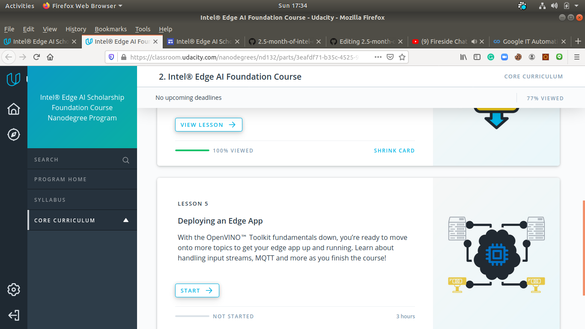

## Day 3: January 20, 2020. #30DaysofUdacity
- My current progress is:\
  **Part 2. Intel® Edge AI Foundation Course** (Progress 80%)\
  **Lesson 5 - Deploying an Edge App** (Progress 18%)\
  **Upto 5. Exercise completed**
  -**OpenCV Basics**\
 - **Handling Input Streams**\
  -**Exercise: Handling Input Streams**
- I encourage @Tabueu Fotso Laurent and @Shahnoza.

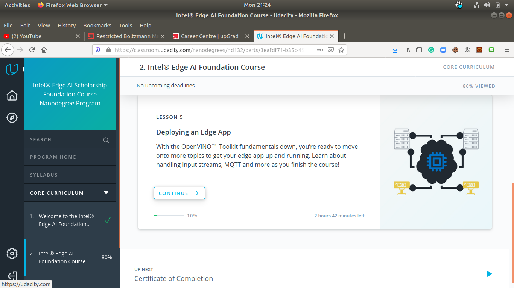\
\
\

## Day 4: January 21, 2020. #30DaysofUdacity
- My current progress is:\
  **Part 2. Intel® Edge AI Foundation Course** (Progress 80%)\
  **Lesson 5 - Deploying an Edge App** (Progress 18%)\
  **Upto 5.5. Exercise completed with below topics**
  -**Gathering Useful Information from Model Outputs**\
 - **Intro to MQTT**\
  -**Communication using MQTT**
- I encourage @Abhishek Mahajan and @JAYANTI SINGH 

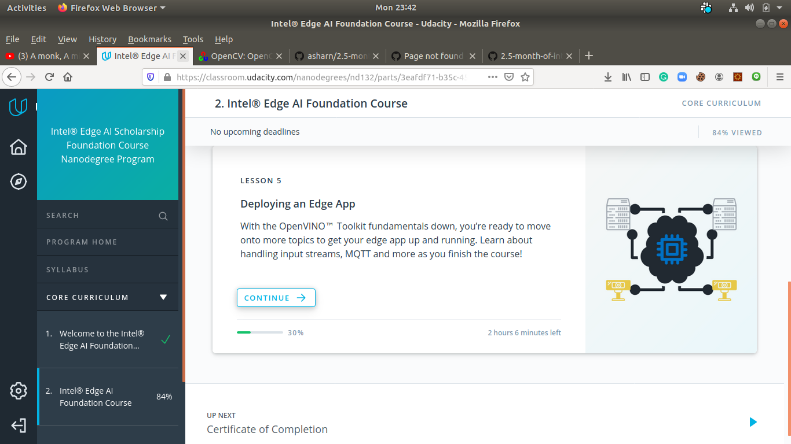\
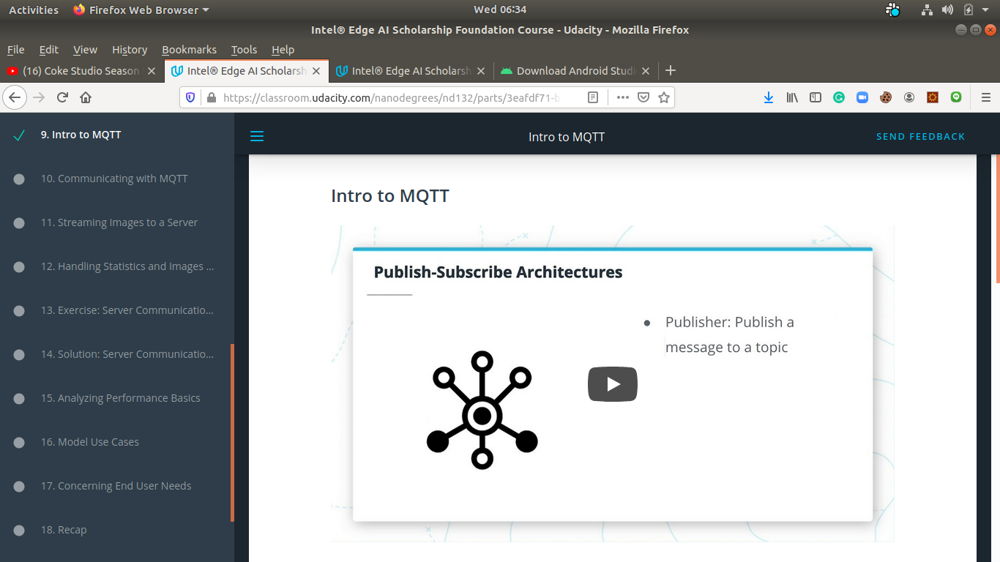\

## Day 5: January 22, 2020. #30DaysofUdacity
- My current progress is:\
  **Part 2. Intel® Edge AI Foundation Course** (Progress 90%)\
  **Lesson 5 - Deploying an Edge App** (Progress 60%)\
  **Upto 5.11. Streaming Images to a Server**
  - **Revised Intro to MQTT**
  - **Revised Communication using MQTT**
  - **Completed topic Streaming Images to a Server**
  - **Completed topic Handling Statistics and Images from a Node Server**
  - **Completed topic Exercise: Server Communications**

- I encourage @aftab and @Vikas Bhandary

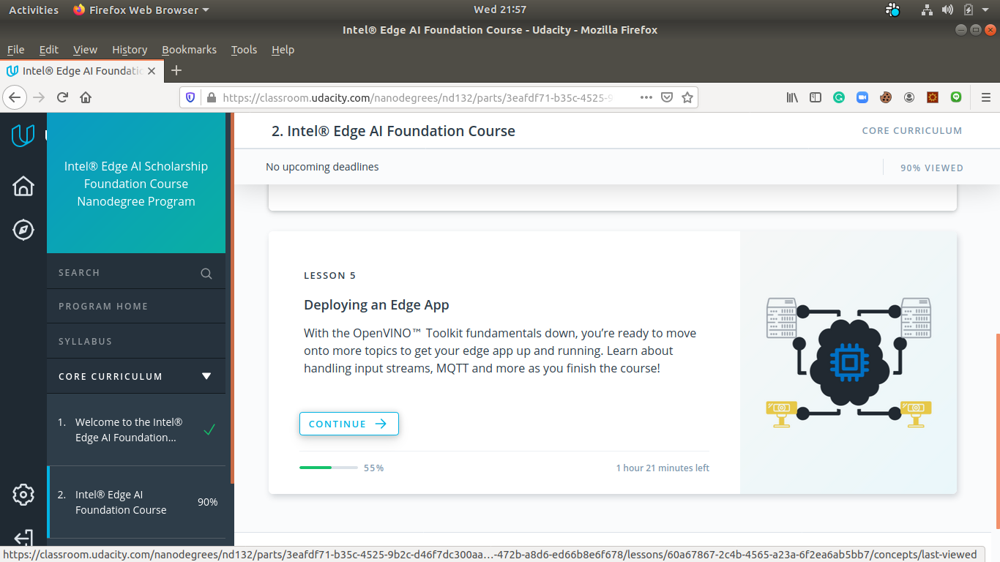
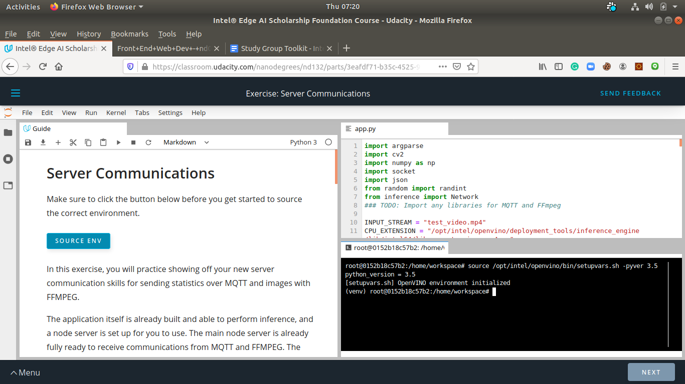

## Day 6: January 23, 2020. #30DaysofUdacity
- My current progress is:\
  **Part 2. Intel® Edge AI Foundation Course** (Progress 96%)\
  **Lesson 5 - Deploying an Edge App** (Progress 80%)\
  **Upto 5.13. Exercise: Server Communications**
  - **Revised Exercise: Server Communications**
  - **Revised Solution of the Exercise**
  - **Completed topic Analyzing Performance Basics**
  - **Completed topic Model Use Cases**

- I encourage @Marco_ and @Sushil

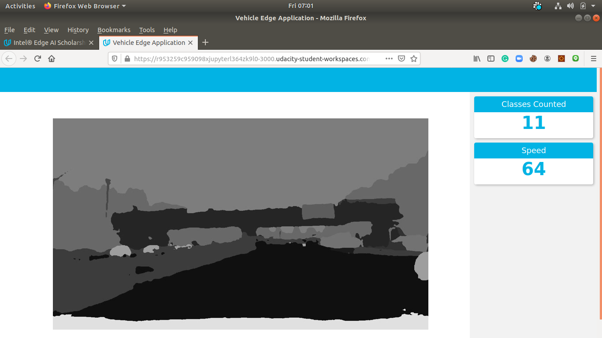
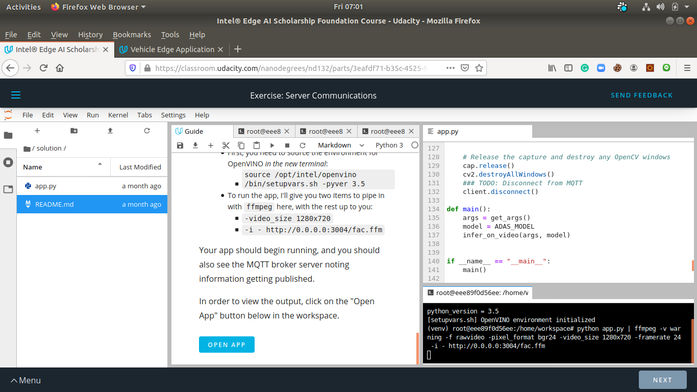

## Day 7: January 24, 2020. #30DaysofUdacity
- My current progress is:\
  **Part 2. Intel® Edge AI Foundation Course** (Progress 98%)\
  **Lesson 5 - Deploying an Edge App** (Progress 92%)\
  **Lession 5 completed**
  - **Revised Analyzing Performance Basics**
  - **Revised Model Use Cases**
  - **Completed topic Concerning End User Needs**
  - **Completed topic Recap**
  - **Completed topic Lession Glossary**
  - **Completed topic Course Recap**

- I encourage @Ankit Vashisht @LauraT @Mohan Barathi @Bappi 
					@Avinash Kumar @MCB @Aishwarya Nevrekar 
					@Abdelrahman Amer @Benson Nwarie @Connor Pollock @Frida 
					@Muhammad.Ali @Qasim Hassan @Frida @aftab @Mai Hassib 
					@Mary Sadimba @Mai Hassib @Maham.Arif @Muhammad.Ali 
					@Advaith @Jess @Shreya Chakrabarti @ZackCodesAI @Bala Priya 
					@Bala Priya @Raamkishore @Rohit_Ghumare @Sayali @Shayekh 
					@Vikas Bhandary @Ahmed @Shubham Kumar @Prabin Shrestha Phoenix 
					@Carnage @Dhananjay @Divya Thakur @LauraT @lamiae hana 
					@Yang @Prabin Shrestha Phoenix @prabhu kumar @RohitVivek 
					@Magda @Jiemin Wang @EvanO @Hugo Oliveira @Rose Gupta 
					@Prudo Koff LODONOU @Dina AbdelRahman @Gage Southard 
					@Sangsaptak Pal @Jongmu Oh #sg_incubator_aiot

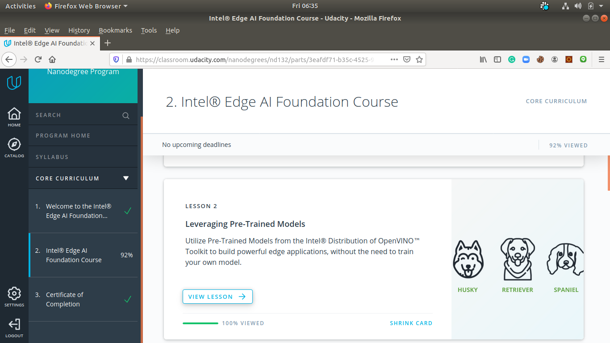
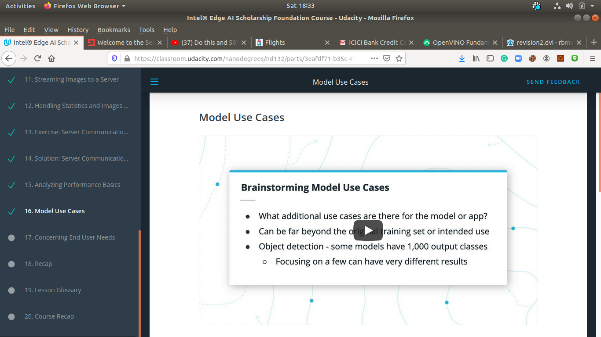
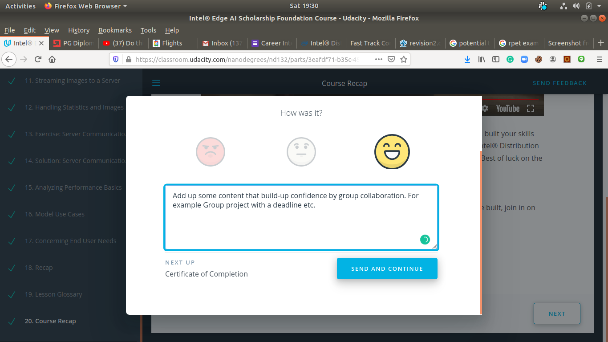
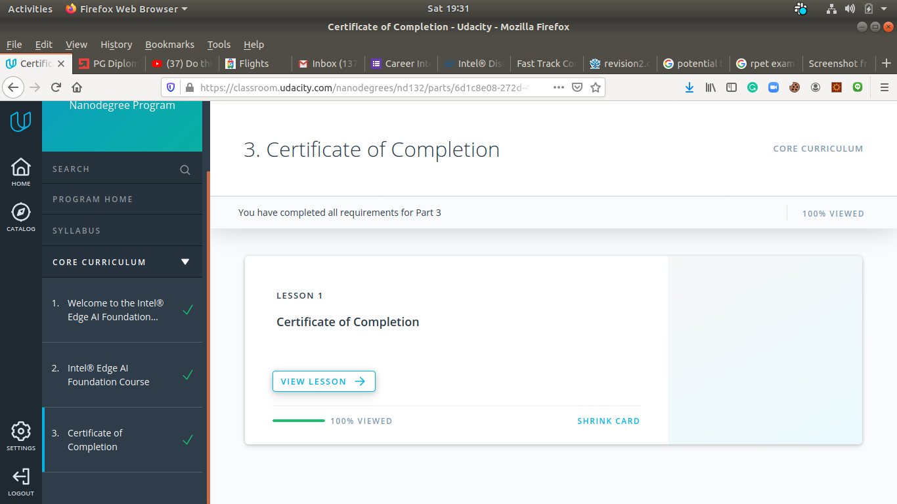

## Day 8: January 25, 2020. #30DaysofUdacity
- My current progress is:\
  **Completed Part 2. Intel® Edge AI Foundation Course** (Progress 100%)\
  **Revision for Part 2. Intel® Edge AI Foundation Course started from lesson 2 to 5 ** (Progress 5%)\
  **Enrolled new course Introduction to Computer Vision in udacity**
  - **Completed first lesson of Computer Vision**
  - **Completed second lesson started**

- I encourage @Ankit Vashisht @LauraT @Mohan Barathi @Bappi @Avinash Kumar

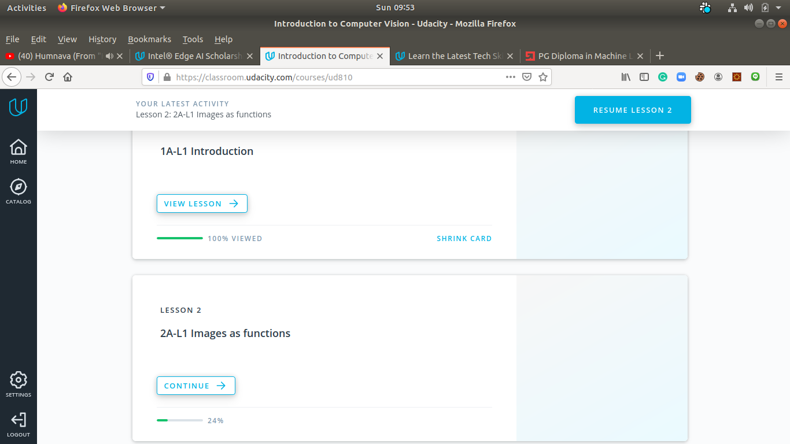
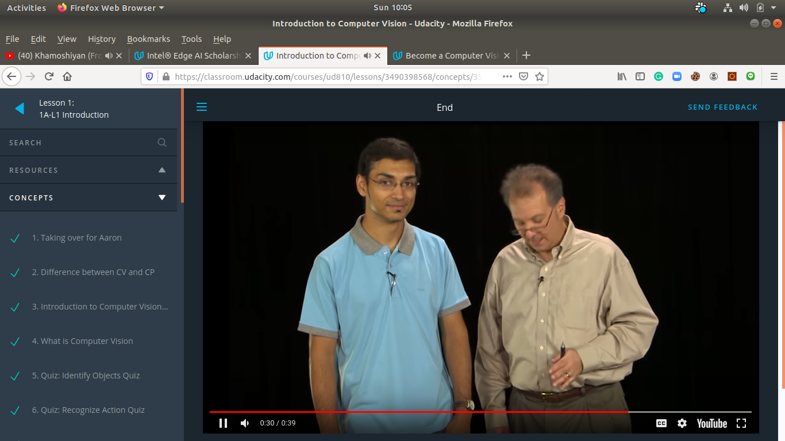
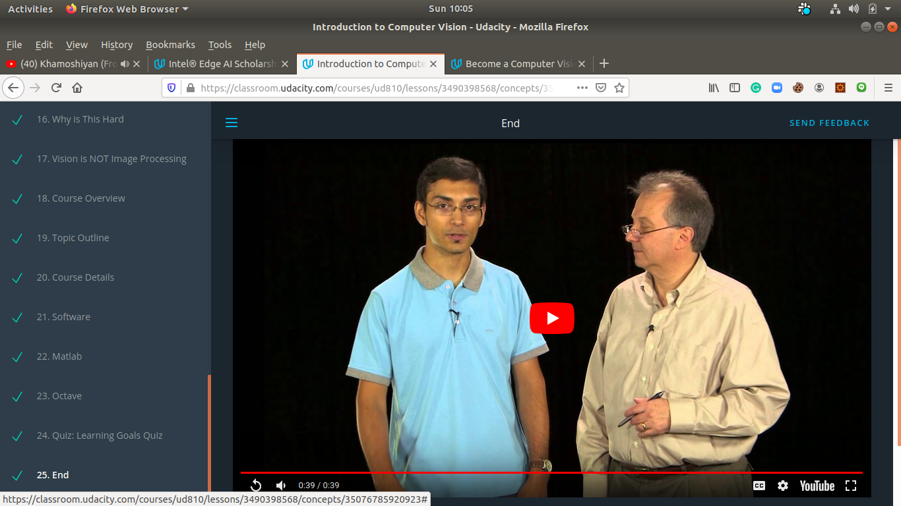

## Day 9: January 26, 2020. #30DaysofUdacity
- Articles and research papers:\
  - 
  - 

- I encourage @Nbenjamin @Christian @Akash Singh @VISHNU VARDHAN REDDY @Patsy

## Day 10: January 27, 2020. #30DaysofUdacity
- Research papers:\
  - 
  - 

- I will encourage random folks @Yang @Prabin Shrestha Phoenix @prabhu kumar @RohitVivek
					@Magda @Jiemin Wang @EvanO @Hugo Oliveira
					@Prudo Koff LODONOU @Dina AbdelRahman @Gage Southard
					@Sangsaptak Pal @Jongmu Oh #sg_incubator_aiot
					@Nbenjamin @Christian @Akash Singh 
					@VISHNU VARDHAN REDDY @Patsy 
					to study deep these papers.

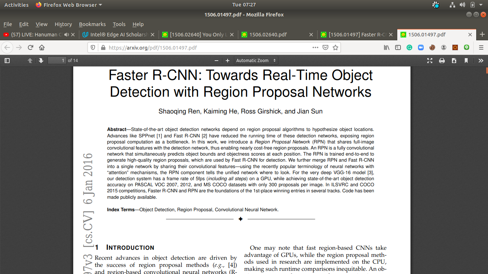
