# 2.5-month-of-intel®-edge-ai

My pledge "2.5 months of Udacity" for the Intel® Edge AI Scholarship Foundation Course Nanodegree Program:\
https://www.udacity.com/scholarships/intel-edge-ai-scholarship
The classroom starts from December 16, 2019 and will End in March 3, 2020.

My pledge "#30DaysofUdacity" with Udacity.
## Day 1: January 18, 2020. #30DaysofUdacity
- I entered the classroom and watched some videos.
- My current progress is:\
  **Part 2. Intel® Edge AI Foundation Course** (Progress 47%)\
  **Lesson 3 - The Model Optimizer** (Progress 47%)\
  **9. Using the Model Optimizer with Caffe Models**
  **Completed lesson 3**
- I encourage @Pawan and @MODF. 

## Day 2: January 19, 2020. #30DaysofUdacity
- My current progress is:\
  **Part 2. Intel® Edge AI Foundation Course** (Progress 77%)\
  **Lesson 4 - The Inference Engine** (Progress 77%)\
  **7. Sending Inference Requests to the IE**
  **Completed lesson 4**
- I encourage @Ankita Kesari and @Ayush Saxena. 

## Day 3: January 20, 2020. #30DaysofUdacity
- My current progress is:\
  **Part 2. Intel® Edge AI Foundation Course** (Progress 80%)\
  **Lesson 5 - Deploying an Edge App** (Progress 18%)\
  **Upto 5. Exercise completed**
  -**OpenCV Basics**\
 - **Handling Input Streams**\
  -**Exercise: Handling Input Streams**
- I encourage @Tabueu Fotso Laurent and @Shahnoza.

\
\
\

## Day 4: January 21, 2020. #30DaysofUdacity
- My current progress is:\
  **Part 2. Intel® Edge AI Foundation Course** (Progress 80%)\
  **Lesson 5 - Deploying an Edge App** (Progress 18%)\
  **Upto 5.5. Exercise completed with below topics**
  -**Gathering Useful Information from Model Outputs**\
 - **Intro to MQTT**\
  -**Communication using MQTT**
- I encourage @Abhishek Mahajan and @JAYANTI SINGH 

\
\

## Day 5: January 22, 2020. #30DaysofUdacity
- My current progress is:\
  **Part 2. Intel® Edge AI Foundation Course** (Progress 90%)\
  **Lesson 5 - Deploying an Edge App** (Progress 60%)\
  **Upto 5.11. Streaming Images to a Server**
  - **Revised Intro to MQTT**
  - **Revised Communication using MQTT**
  - **Completed topic Streaming Images to a Server**
  - **Completed topic Handling Statistics and Images from a Node Server**
  - **Completed topic Exercise: Server Communications**

- I encourage @aftab and @Vikas Bhandary

## Day 6: January 23, 2020. #30DaysofUdacity
- My current progress is:\
  **Part 2. Intel® Edge AI Foundation Course** (Progress 96%)\
  **Lesson 5 - Deploying an Edge App** (Progress 80%)\
  **Upto 5.13. Exercise: Server Communications**
  - **Revised Exercise: Server Communications**
  - **Revised Solution of the Exercise**
  - **Completed topic Analyzing Performance Basics**
  - **Completed topic Model Use Cases**

- I encourage @Marco_ and @Sushil

## Day 7: January 24, 2020. #30DaysofUdacity
- My current progress is:\
  **Part 2. Intel® Edge AI Foundation Course** (Progress 98%)\
  **Lesson 5 - Deploying an Edge App** (Progress 92%)\
  **Lession 5 completed**
  - **Revised Analyzing Performance Basics**
  - **Revised Model Use Cases**
  - **Completed topic Concerning End User Needs**
  - **Completed topic Recap**
  - **Completed topic Lession Glossary**
  - **Completed topic Course Recap**

- I encourage @Ankit Vashisht @LauraT @Mohan Barathi @Bappi 
					@Avinash Kumar @MCB @Aishwarya Nevrekar 
					@Abdelrahman Amer @Benson Nwarie @Connor Pollock @Frida 
					@Muhammad.Ali @Qasim Hassan @Frida @aftab @Mai Hassib 
					@Mary Sadimba @Mai Hassib @Maham.Arif @Muhammad.Ali 
					@Advaith @Jess @Shreya Chakrabarti @ZackCodesAI @Bala Priya 
					@Bala Priya @Raamkishore @Rohit_Ghumare @Sayali @Shayekh 
					@Vikas Bhandary @Ahmed @Shubham Kumar @Prabin Shrestha Phoenix 
					@Carnage @Dhananjay @Divya Thakur @LauraT @lamiae hana 
					@Yang @Prabin Shrestha Phoenix @prabhu kumar @RohitVivek 
					@Magda @Jiemin Wang @EvanO @Hugo Oliveira @Rose Gupta 
					@Prudo Koff LODONOU @Dina AbdelRahman @Gage Southard 
					@Sangsaptak Pal @Jongmu Oh #sg_incubator_aiot

## Day 8: January 25, 2020. #30DaysofUdacity
- My current progress is:\
  **Completed Part 2. Intel® Edge AI Foundation Course** (Progress 100%)\
  **Revision for Part 2. Intel® Edge AI Foundation Course started from lesson 2 to 5 ** (Progress 5%)\
  **Enrolled new course Introduction to Computer Vision in udacity**
  - **Completed first lesson of Computer Vision**
  - **Completed second lesson started**

- I encourage @Ankit Vashisht @LauraT @Mohan Barathi @Bappi @Avinash Kumar

## Day 9: January 26, 2020. #30DaysofUdacity
- Articles and research papers:\
  - [**Image Classification vs. Object Detection vs. Image Segmentation**](https://medium.com/analytics-vidhya/image-classification-vs-object-detection-vs-image-segmentation-f36db85fe81)
  - [**The Single Shot Multibox Detector (SSD) model**](https://arxiv.org/abs/1512.02325)

- I encourage @Nbenjamin @Christian @Akash Singh @VISHNU VARDHAN REDDY @Patsy

## Day 10: January 27, 2020. #30DaysofUdacity
- Research papers:\
  - [**You Only Look Once: YOLO**](https://arxiv.org/abs/1506.02640)
  - [**Faster R-CNN: Towards Real-Time ObjectDetection with Region Proposal Networks**](https://arxiv.org/abs/1506.01497)

- I will encourage random folks @Yang @Prabin Shrestha Phoenix @prabhu kumar @RohitVivek
					@Magda @Jiemin Wang @EvanO @Hugo Oliveira
					@Prudo Koff LODONOU @Dina AbdelRahman @Gage Southard
					@Sangsaptak Pal @Jongmu Oh #sg_incubator_aiot
					@Nbenjamin @Christian @Akash Singh 
					@VISHNU VARDHAN REDDY @Patsy 
					to study deep these papers.

## Day 11: January 28, 2020. #30DaysofUdacity
- Research papers:\
  - [**MobileNets: Efficient Convolutional Neural Networks for Mobile Vision Applications**](https://arxiv.org/pdf/1704.04861.pdf)
  - Again study and setup system to practice on local : [**Faster R-CNN: Towards Real-Time ObjectDetection with Region Proposal Networks**](https://arxiv.org/abs/1506.01497)
  - **Open-Source Contribution git & Github Session**
  	- Part1:  [**Basic about Git and Github**](https://youtu.be/9Fo8bSKJpFk)
	- Part2:  [**Open-Source Contribution, Licences, workflow and QA session**](https://youtu.be/1CbXqQCugD0)

- **Recommendation to visit Part2. It's very informative.**

- I will encourage random folks @Jess @Sheldon @Shahnoza @Mobasshir Bhuiyan @Bala Priya 
                                @Ankita Kesari @Neha Soni @Hein@realrajanpaudel
				@Nikita Mahajan  @Juber Rahman @OS_the_Person_
				@Abhishek Kovuri @Vidhi @Martin-Philipp Irsch @Xander
				@Rimon @Jorge Andrés Hernández Jara @cristian.cucchiella 
				@Celestine Okonkwo @K.S. @Mohan Barathi @MCB @Ankit Vashisht 
				@Avinash Kumar @LauraT @Lesliel @Arka @Marco_ @Bappi
					to study deep these papers.

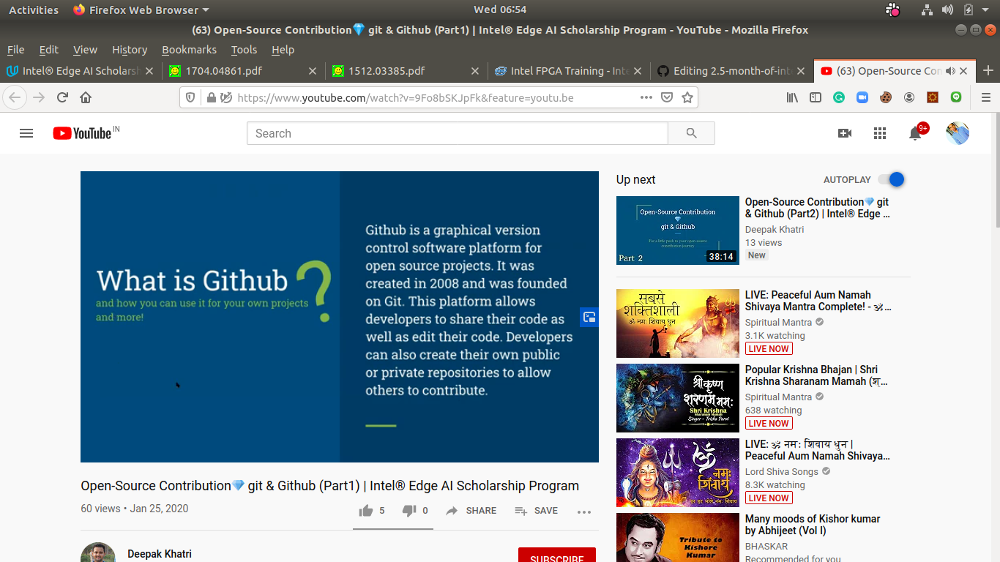
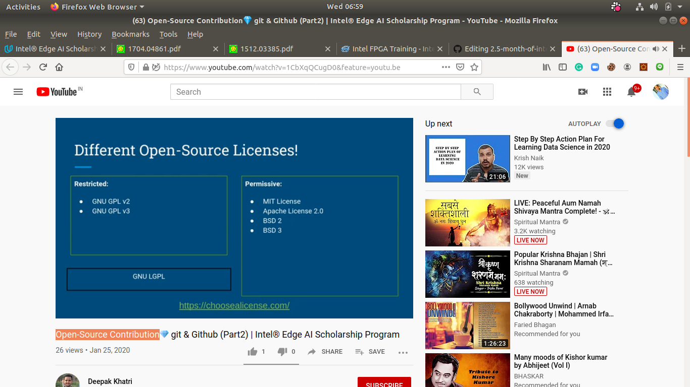

## Day 12: January 29, 2020. #30DaysofUdacity
- Research papers:\
  - Completed: [**ResNet: Deep Residual Learning for Image Recognition**](https://arxiv.org/abs/1512.03385)
  - Completed: [**Inception: Going deeper with convolutions**](https://arxiv.org/pdf/1409.4842.pdf)
  - Code practice realted to these papers need to be done.
- I will encourage random folks @Jess @Sheldon @Mobasshir Bhuiyan @Bala Priya 
                                @Hein @realrajanpaudel to study deep these papers.

## Day 13: January 30, 2020. #30DaysofUdacity
- Article and Research paper:\
  - [**Understanding SSD MultiBox — Real-Time Object Detection In Deep Learning**](https://towardsdatascience.com/understanding-ssd-multibox-real-time-object-detection-in-deep-learning-495ef744fab)
  - [**Going beyond the bounding box with semantic segmentation**](https://thegradient.pub/semantic-segmentation/)

- I will encourage random folks @Anna Scott @arundhatee @Clinton B @Ahmed
					@Magda @Adriana Chen @EvanO @Hugo Oliveira
					@Aitor @Alex Ho 
					to study deep these papers.

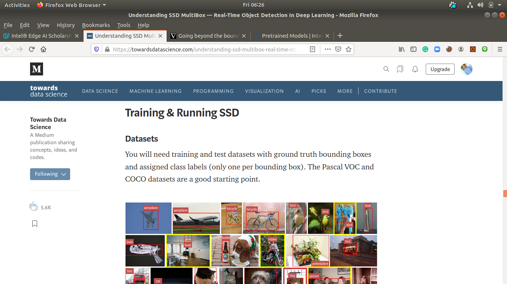
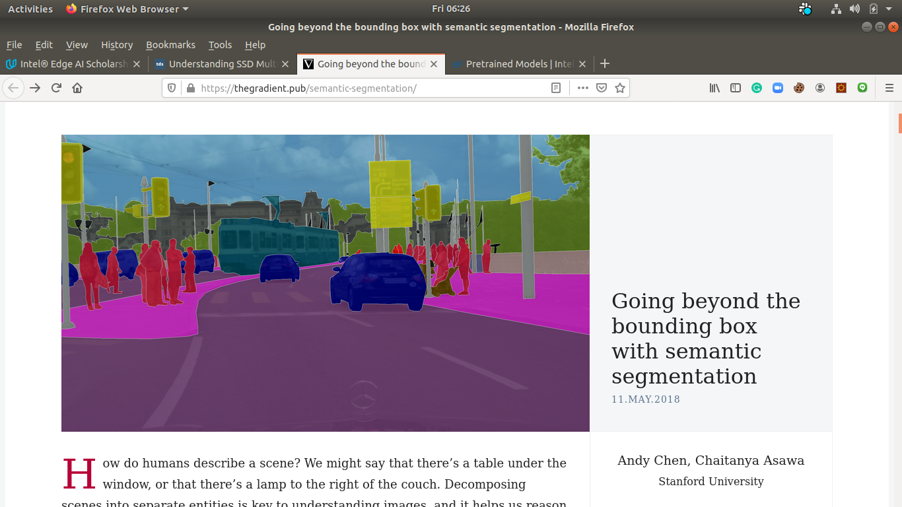

## Day 14: January 31, 2020. #30DaysofUdacity
- Article and Research paper:\
  - [**Model Optimizer Developer Guide**](https://docs.openvinotoolkit.org/latest/_docs_MO_DG_Deep_Learning_Model_Optimizer_DevGuide.html)
  - [**Quantization**](https://nervanasystems.github.io/distiller/quantization.html/)
  - [**Model Optimization Techniques**](https://docs.openvinotoolkit.org/latest/_docs_MO_DG_prepare_model_Model_Optimization_Techniques.html)

- I will encourage some folks @Akash Singh @Rohit.intelai @Shreya Chakrabarti 
					@Shahnoza @Lesliel @Aarthi Alagammai @Anna Scott 
					@arundhatee @Clinton B @Ahmed@Nikita Mahajan  
					@Magda @Adriana Chen @EvanO @Hugo Oliveira
					@Aitor @Alex Ho @Neha Soni @Hein@realrajanpaudel
					@Juber Rahman to study deep these papers.

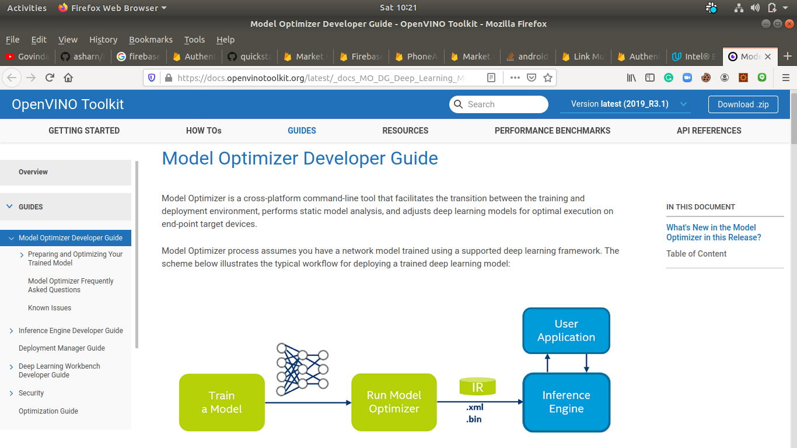
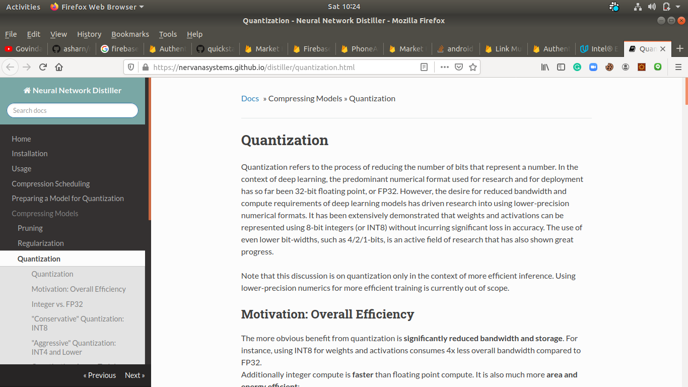
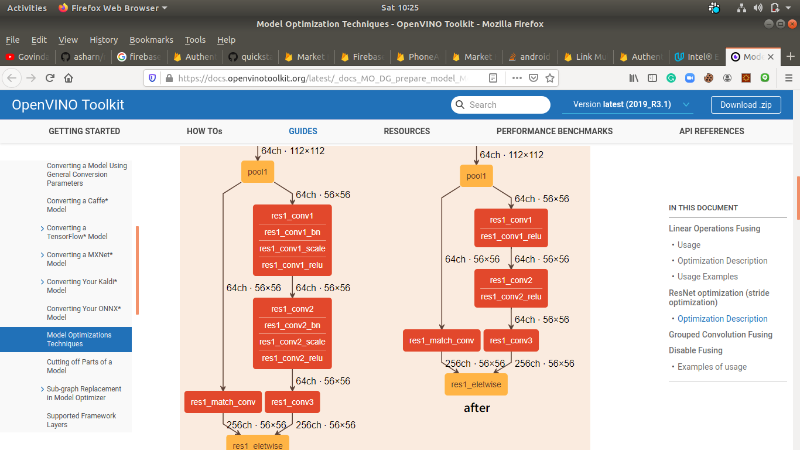

## Day 15: February 2nd, 2020. #30DaysofUdacity
I continue the challenge #30DaysofUdacity after one day of rest on 1st Feb 2020.
- Study deep on the following frameworks:\
  - [**Caffe**](https://caffe.berkeleyvision.org/)
  - [**TensorFlow**](https://www.tensorflow.org/)
	- [**What the Hell is “Tensor” in “TensorFlow”?**](https://hackernoon.com/what-the-hell-is-tensor-in-tensorflow-e40dbf0253ee)
	- [**TensorFlow, why was python the chosen language?**](https://stackoverflow.com/questions/35677724/tensorflow-why-was-python-the-chosen-language)	

- I will encourage some folks @Akash Singh @Rohit.intelai @Shreya Chakrabarti 
					@Shahnoza @Lesliel @Aarthi Alagammai @Anna Scott 
					@arundhatee @Clinton B @Ahmed@Nikita Mahajan  
					@Magda @Adriana Chen @EvanO @Hugo Oliveira
					@Aitor @Alex Ho @Neha Soni @Hein@realrajanpaudel
					@Juber Rahman @barbear to study deep these papers.

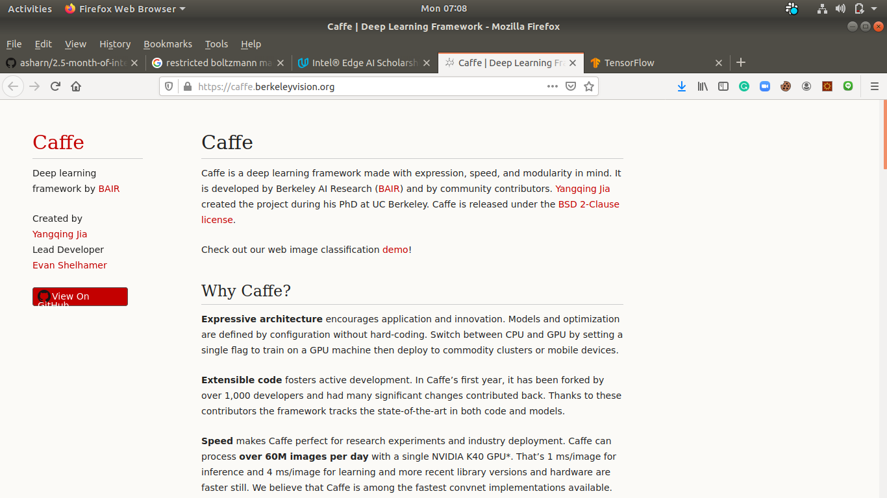
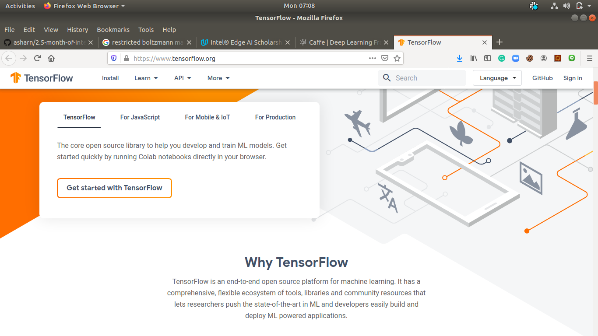
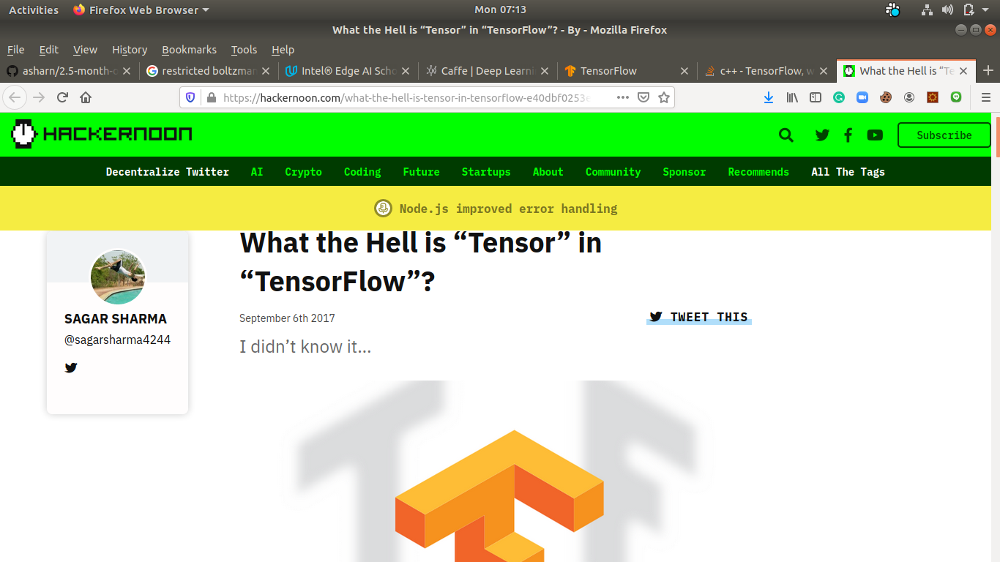

## Day 16: February 3rd, 2020. #30DaysofUdacity
I am going through all references material present within course.
- Study deep on the following frameworks:\
  - [**MXNet**](https://mxnet.apache.org/)
  	- [**MXNet: A Flexible and Efficient Machine LearningLibrary for Heterogeneous Distributed Systems**](https://www.cs.cmu.edu/~muli/file/mxnet-learning-sys.pdf)	
  - [**ONNX**](https://onnx.ai/)
	- [**What every ML/AI developer should know about ONNX**](https://blog.paperspace.com/what-every-ml-ai-developer-should-know-about-onnx/)

## Day 17: February 4th, 2020. #30DaysofUdacity
I am going through all references material present within course in deep.
- Study deep on the following frameworks:\
  - [**Converting a Model to Intermediate Representation (IR)**](https://docs.openvinotoolkit.org/latest/_docs_MO_DG_prepare_model_convert_model_Converting_Model.html)
  - [**Supported Framework Layers**](https://docs.openvinotoolkit.org/latest/_docs_MO_DG_prepare_model_Supported_Frameworks_Layers.html)
  - [**Intermediate Representation Notation Reference Catalog**](https://docs.openvinotoolkit.org/latest/_docs_MO_DG_prepare_model_convert_model_IRLayersCatalogSpec.html)
	- [**Activation Layer**]
	- [**ArgMax Layer**]
	- [**BatchNormalization Layer**]
	- [**BinaryConvolution Layer**]
	- [**Broadcast Layer**]

- I will encourage some folks @Akash Singh @Rohit.intelai @Shreya Chakrabarti 
					@Shahnoza @Lesliel @Aarthi Alagammai @Anna Scott 
					@arundhatee @Clinton B @Ahmed@Nikita Mahajan  
					@Magda @Adriana Chen @EvanO @Hugo Oliveira
					@Aitor @Alex Ho @Neha Soni @Hein@realrajanpaudel
					@Juber Rahman @barbear to study deep these papers.

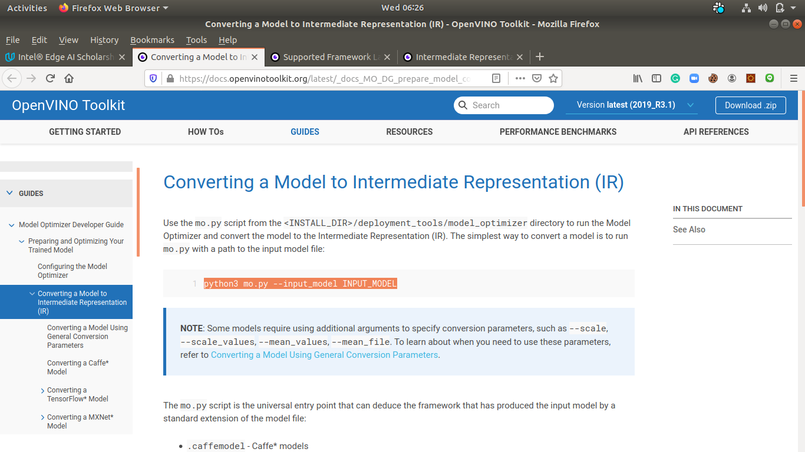
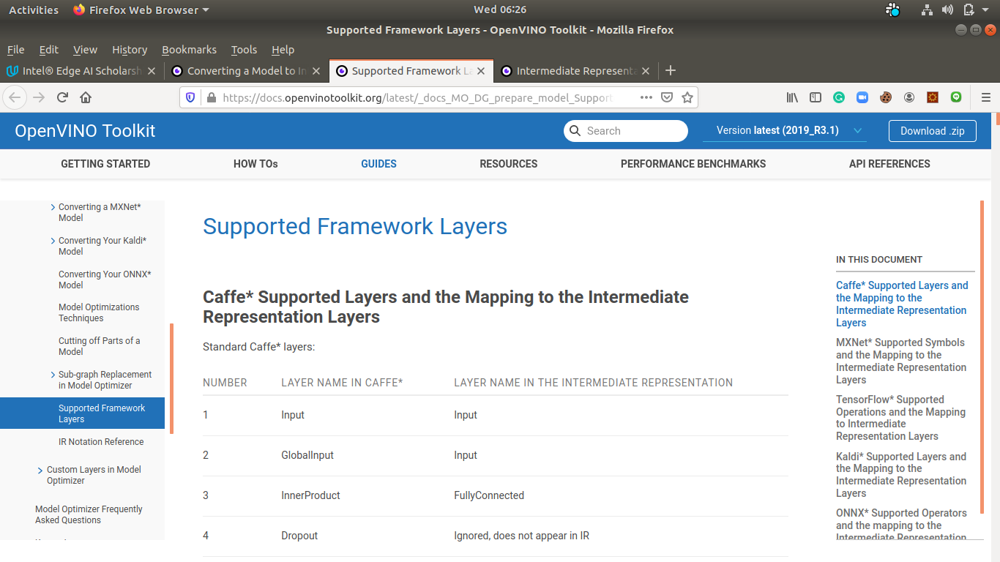
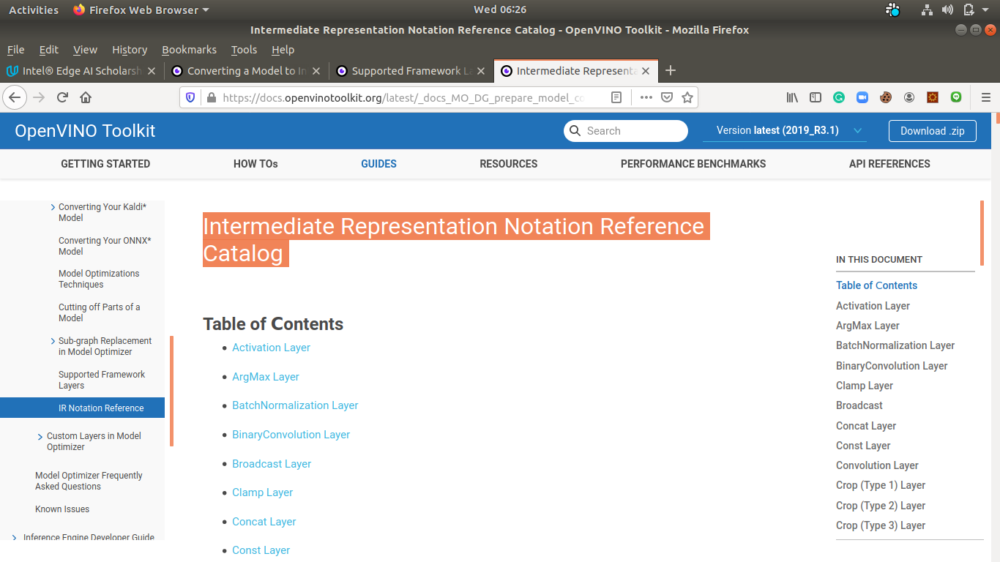

## Day 18: February 5th, 2020. #30DaysofUdacity
I am going through all references material present within course in deep.
- Further Research:
  - [**Converting a TensorFlow\* Model**](https://docs.openvinotoolkit.org/latest/_docs_MO_DG_prepare_model_convert_model_Convert_Model_From_TensorFlow.html)\
  In this document, I learned:
	- Basic information about how the Model Optimizer works with TensorFlow* models
	- Which TensorFlow models are supported
	- How to freeze a TensorFlow model
	- How to convert a trained TensorFlow model using the Model Optimizer with both framework-agnostic and TensorFlow-specific command-line options

  - [**Tensorflow detection model zoo**](https://github.com/tensorflow/models/blob/master/research/object_detection/g3doc/detection_model_zoo.md#tensorflow-detection-model-zoo)

- I will encourage some folks @Akash Singh @Rohit.intelai @Shreya Chakrabarti 
					@Shahnoza @Lesliel @Aarthi Alagammai @Anna Scott 
					@arundhatee @Clinton B @Ahmed@Nikita Mahajan  
					@Magda @Adriana Chen @EvanO @Hugo Oliveira
					@Aitor @Alex Ho @Neha Soni @Hein@realrajanpaudel
					@Juber Rahman @barbear to study deep these papers.

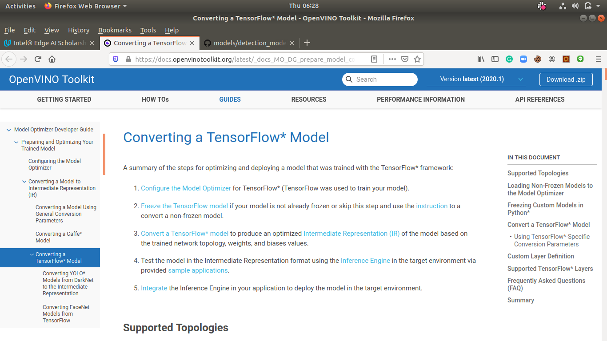
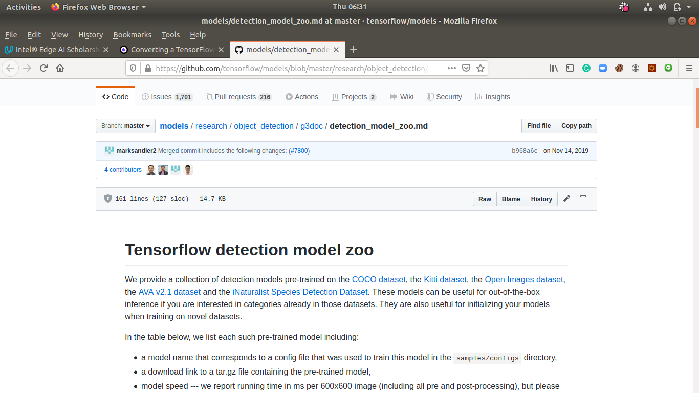

## Day 19: February 6th, 2020. #30DaysofUdacity
I am going through all references material present within course in deep.
- Further Research:
  - [**Converting a Caffe\* Model**](https://docs.openvinotoolkit.org/latest/_docs_MO_DG_prepare_model_convert_model_Convert_Model_From_Caffe.html)\
  In this document, I learned:
	- Basic information about how the Model Optimizer works with Caffe* models
	- Which Caffe* models are supported
	- How to convert a trained Caffe* model using the Model Optimizer with both framework-agnostic and Caffe-specific command-line options 
	- Study some more articles and research paper

  - [**Converting a ONNX\* Model**](https://docs.openvinotoolkit.org/latest/_docs_MO_DG_prepare_model_convert_model_Convert_Model_From_ONNX.html)
    In this document, I learned:
	- Basic information about how the Model Optimizer works with ONNX* models
	- Which ONNX* models are supported
	- Supported Pytorch*, PaddlePaddle* Models via ONNX Conversion
	- Study some more articles and research paper

- I will encourage awesome folks who are going great @Akash Singh @Rohit.intelai @Shreya Chakrabarti 
					@Shahnoza @Lesliel @Aarthi Alagammai @Anna Scott 
					@arundhatee @Clinton B @Ahmed@Nikita Mahajan  
					@Magda @Adriana Chen @EvanO @Hugo Oliveira
					@Aitor @Alex Ho @Neha Soni @Hein@realrajanpaudel
					@Juber Rahman @bearbear.

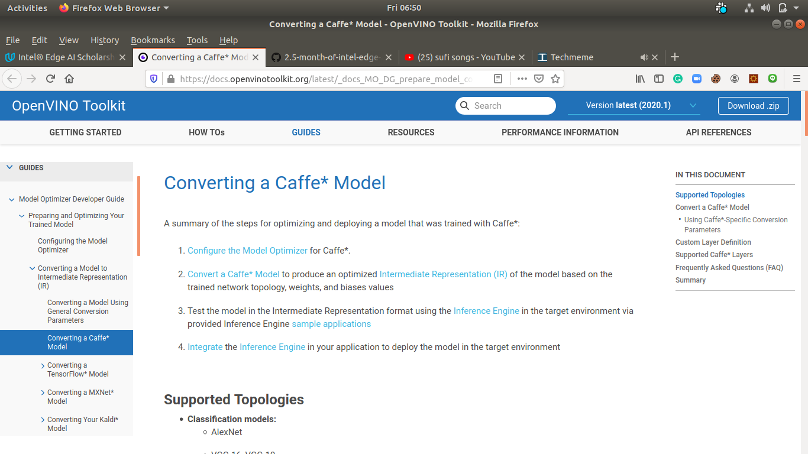
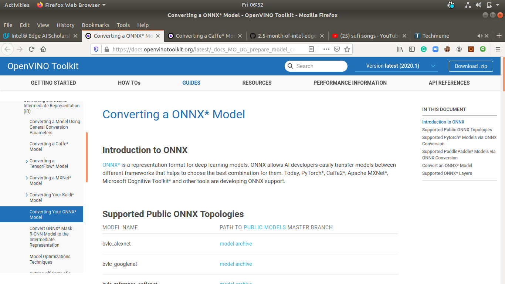

## Day 20: February 7th, 2020. #30DaysofUdacity
I am going through all references material present within course in deep.
- Further Research:
  - [**ONNX also has additional models available in the ONNX Model Zoo**](https://github.com/onnx/models)\
  In this document, I learned:
	- The ONNX Model Zoo is a collection of pre-trained, state-of-the-art models in the ONNX format
		- Vision
			 - Image Classification
			 - Object Detection & Image Segmentation
			 - Body, Face & Gesture Analysis
	   
		- Language
			- Machine Translation

		- Other
			- Visual Question Answering & Dialog
  - I get inspired and motivated by the work @Juan Carlos Kuri Pinto is doing. YOU ARE AWESOME KEEP IT UP :)
  - I will encourage awesome folks who are going great  @Akash Singh @Rohit.intelai @Shreya Chakrabarti
					@Shahnoza @Lesliel @Aarthi Alagammai @Anna Scott
					@arundhatee @Clinton B @Ahmed @Nikita Mahajan
					@Magda @Adriana Chen @EvanO @Hugo Oliveira
					@Neha Soni @Hein@realrajanpaudel
					@Juber Rahman @Bearbear@Tchouanga @Richárd Ádám Vécsey Dr.
                    @Asad Ur Rahman @Marco_ @Irina_Gr @Emeka @Boris @Filipe Queiroz
                    @Anna Scott @María V @N. Hussain @nagendra_init @AndyP @Boris @Ankita Kesari@Nada Aweaa.

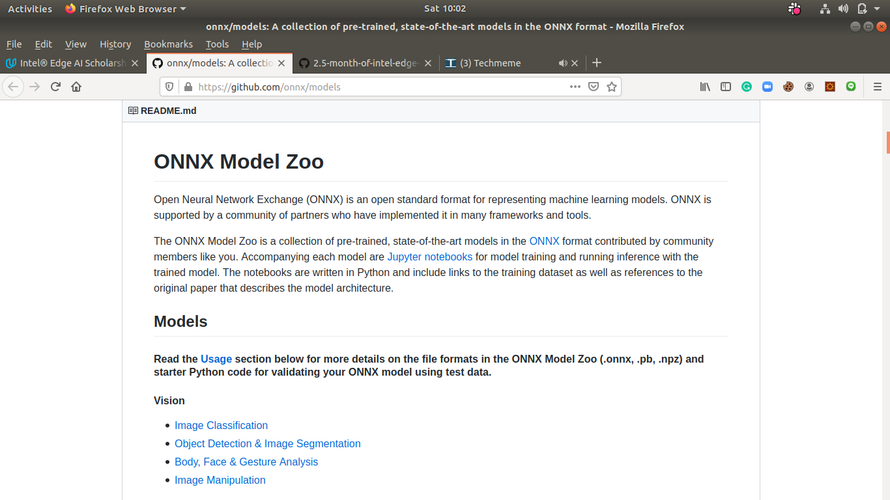 	

## Day 21: February 8th, 2020. #30DaysofUdacity
I am going through all references material present within course in deep.
- Further Research:
  - [**Cutting Off Parts of a Model**](https://docs.openvinotoolkit.org/latest/_docs_MO_DG_prepare_model_convert_model_Cutting_Model.html)\
  - [**Custom Layers in the Model Optimizer**](https://docs.openvinotoolkit.org/latest/_docs_MO_DG_prepare_model_customize_model_optimizer_Customize_Model_Optimizer.html)
  
  - I will encourage awesome folks who are going great  @Akash Singh @Rohit.intelai @Shreya Chakrabarti
					@Shahnoza @Lesliel @Aarthi Alagammai @Anna Scott
					@arundhatee @Clinton B @Ahmed @Nikita Mahajan
					@Magda @Adriana Chen @EvanO @Hugo Oliveira
					@Neha Soni @Hein@realrajanpaudel
					@Juber Rahman @Bearbear@Tchouanga @Richárd Ádám Vécsey Dr.
                    @Asad Ur Rahman @Marco_ @Irina_Gr @Emeka @Boris @Filipe Queiroz
                    @Anna Scott @María V @N. Hussain @nagendra_init @AndyP @Boris @Ankita Kesari@Nada Aweaa.
					@Fabrizio Cacicia @rodbelisario @kareem.h @Jorge Andrés Hernández Jara @Gustavo94 @Richárd Ádám Vécsey Dr. 
					@Fernando Terrazas @HUY DUC VO @Juan Jose Moreno Guadamur @Faisal Raza Khan @Edna Sawe
					
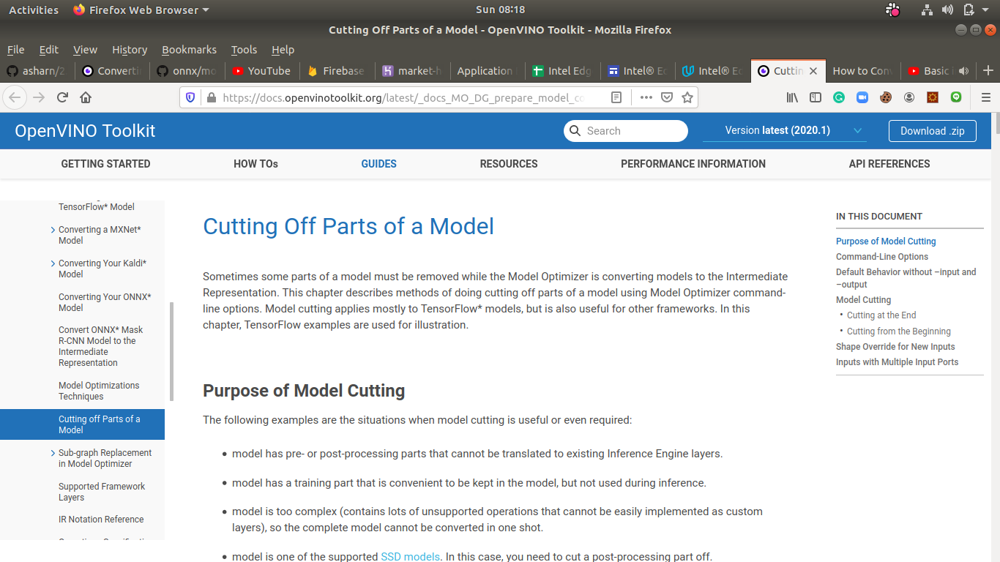 	
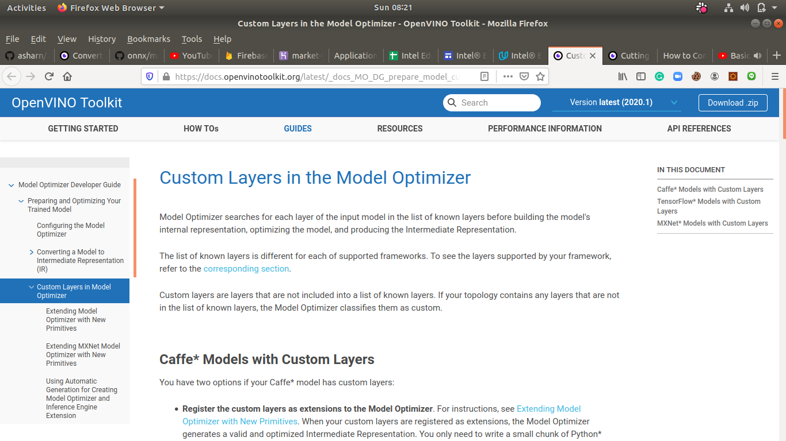 	

## Day 22: February 9th, 2020. #30DaysofUdacity
I am going through all references material present within course in deep.
- Further Research links present at last lines of 4.7: Sending Inference Requests to the IE are not working:
  - [**Executable Network documentation**](https://docs.openvinotoolkit.org/latest/classie__api_1_1ExecutableNetwork.html)
  - [**Infer Request documentation**](https://docs.openvinotoolkit.org/latest/classie__api_1_1InferRequest.html)
- Further Research links present at last lines of 4.3: Using the Inference Engine with an IR are not working:
  - [**IE Python API**](https://docs.openvinotoolkit.org/latest/ie_python_api.html)
  - [**IE Network**](https://docs.openvinotoolkit.org/latest/classie__api_1_1IENetwork.html)
  - [**IE Core**](https://docs.openvinotoolkit.org/latest/classie__api_1_1IECore.html)

- Read these contents:
  - [**Supported Devices and their Optimal Configurations**](https://docs.openvinotoolkit.org/latest/_docs_IE_DG_supported_plugins_Supported_Devices.html)
  - [**Synchronous vs. Asynchronous API's**](https://docs.openvinotoolkit.org/latest/_docs_IE_DG_supported_plugins_Supported_Devices.html)
  
  - I will encourage awesome folks who are going great  @Akash Singh @Rohit.intelai @Shreya Chakrabarti
					@Shahnoza @Lesliel @Aarthi Alagammai @Anna Scott
					@arundhatee @Clinton B @Ahmed @Nikita 
					@Magda @Adriana Chen @EvanO @Hugo Oliveira
					@Neha Soni @Hein@realrajanpaudel
					@Juber Rahman @Bearbear@Tchouanga @Richárd Ádám Vécsey Dr.
                    @Asad Ur Rahman @Marco_ @Irina_Gr @Emeka @Boris @Filipe Queiroz 
                    @Anna Scott @María V @N. Hussain @nagendra_init @AndyP @Boris @Ankita Kesari@Nada Aweaa.
					@Fabrizio Cacicia @rodbelisario @kareem.h @Jorge Andrés Hernández Jara @Gustavo94 @Richárd Ádám Vécsey Dr.
					@Fernando Terrazas @HUY DUC VO @Juan Jose Moreno Guadamur @MODF @Faisal Raza Khan @Edna Sawe
					@Ife Ade @Filipe Queiroz  @Wonde @Richárd Ádám Vécsey Dr.@Deep Khurana @Bhuvaneswari
					
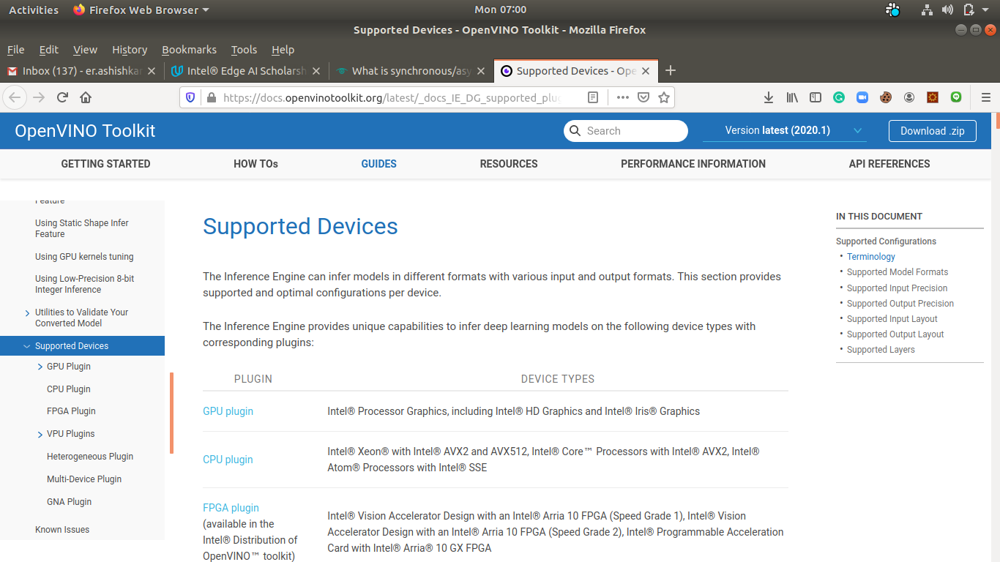 	
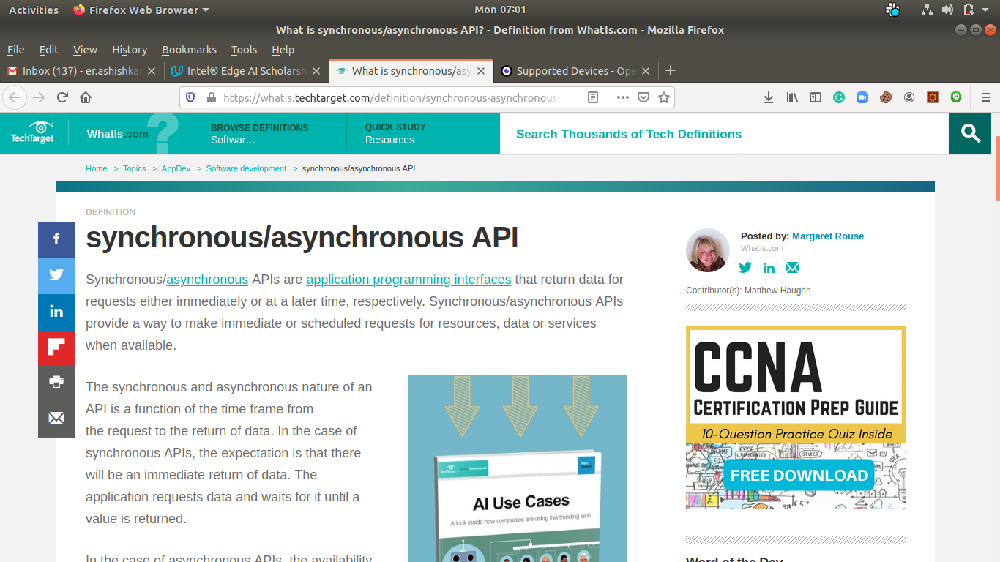 	

## Day 23: February 10th, 2020. #30DaysofUdacity
I am going through all references material present within course in deep.
- Further Research everyone must read:
  - [**Integrate the Inference Engine with Your Application**](https://docs.openvinotoolkit.org/latest/_docs_IE_DG_Integrate_with_customer_application_new_API.html)
  - [**Object Detection SSD C++ Demo, Async API Performance Showcase**](https://github.com/opencv/open_model_zoo/blob/master/demos/object_detection_demo_ssd_async/README.md)
  
  - I will encourage awesome folks who are going great  
					@Akash Singh @Rohit.intelai @Shreya Chakrabarti
					@Shahnoza @Lesliel @Aarthi Alagammai @Anna Scott
					@arundhatee @Clinton B @Ahmed @Nikita 
					@Magda @Adriana Chen @EvanO @Hugo Oliveira
					@Neha Soni @Hein@realrajanpaudel
					@Juber Rahman @Bearbear@Tchouanga @Richárd Ádám Vécsey Dr.
                    @Asad Ur Rahman @Marco_ @Irina_Gr @Emeka @Boris @Filipe Queiroz 
                    @Anna Scott @María V @N. Hussain @nagendra_init @AndyP @Boris @Ankita Kesari@Nada Aweaa.
					@Fabrizio Cacicia @rodbelisario @kareem.h @Jorge Andrés Hernández Jara @Gustavo94 @Richárd Ádám Vécsey Dr.
					@Fernando Terrazas @HUY DUC VO @Juan Jose Moreno Guadamur @MODF @Faisal Raza Khan @Edna Sawe
					@Ife Ade @Filipe Queiroz  @Wonde @Richárd Ádám Vécsey Dr.@Deep Khurana @Bhuvaneswari @Odaliz Balcazar @davisclick 
					@Athanasios Alexopoulos @Atul Awasthi @Stanislav Ladyzhenskiy @Nikhil Tiwari @shahidaac 
					
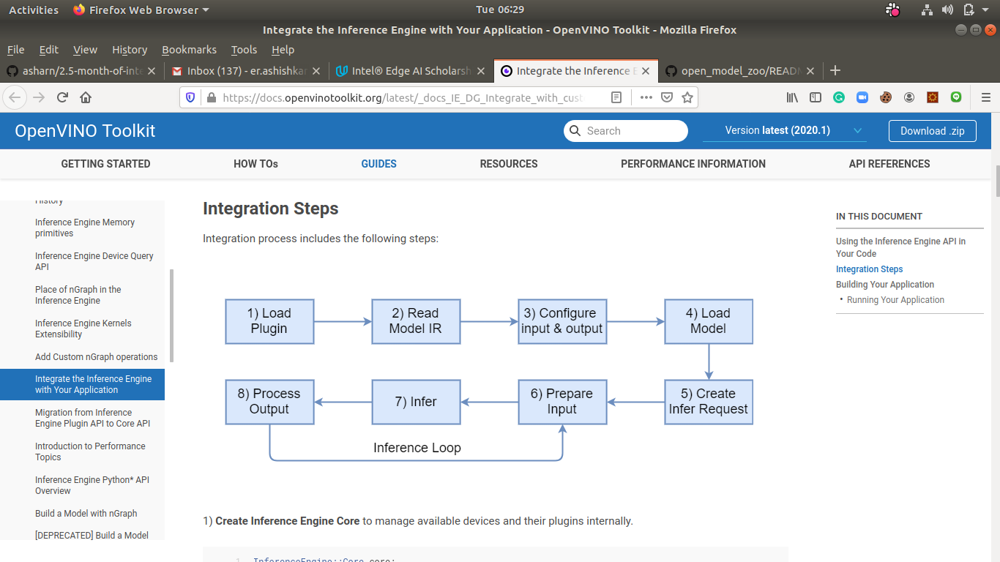 	
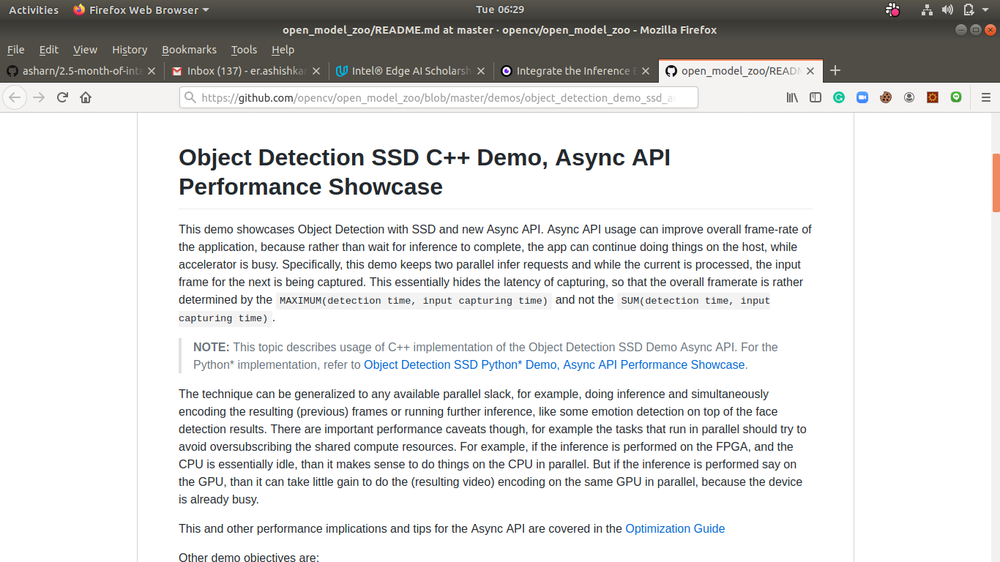 	

## Day 24: February 11th, 2020. #30DaysofUdacity
I am going through all references material present within course in deep.
- Further Research as good stuffs:
  - [**Intel®’s IoT Apps Across Industries**](https://www.intel.com/content/www/us/en/internet-of-things/industry-solutions.html)
		- [**Powering a Revolution in Driving**](https://www.intel.com/content/www/us/en/automotive/automotive-overview.html)
		- [**Smart Homes with Intel® Internet of Things (IoT) Technologies**](https://www.intel.com/content/www/us/en/internet-of-things/smart-home.html)
  - [**The Ultimate Guide To Starting Your First IoT Project**](https://hackernoon.com/the-ultimate-guide-to-starting-your-first-iot-project-8b0644fbbe6d)
  
  - I will encourage awesome folks who are going great  
					@Akash Singh @Rohit.intelai @Shreya Chakrabarti
					@Shahnoza @Lesliel @Aarthi Alagammai @Anna Scott
					@arundhatee @Clinton B @Ahmed @Nikita 
					@Magda @Adriana Chen @EvanO @Hugo Oliveira
					@Neha Soni @Hein@realrajanpaudel
					@Juber Rahman @Bearbear@Tchouanga @Richárd Ádám Vécsey Dr.
                    @Asad Ur Rahman @Marco_ @Irina_Gr @Emeka @Boris @Filipe Queiroz 
                    @Anna Scott @María V @N. Hussain @nagendra_init @AndyP @Boris @Ankita Kesari@Nada Aweaa.
					@Fabrizio Cacicia @rodbelisario @kareem.h @Jorge Andrés Hernández Jara @Gustavo94 @Richárd Ádám Vécsey Dr.
					@Fernando Terrazas @HUY DUC VO @Juan Jose Moreno Guadamur @MODF @Faisal Raza Khan @Edna Sawe
					@Ife Ade @Filipe Queiroz  @Wonde @Richárd Ádám Vécsey Dr.@Deep Khurana @Bhuvaneswari @Odaliz Balcazar @davisclick 
					@Athanasios Alexopoulos @Atul Awasthi @Stanislav Ladyzhenskiy @Nikhil Tiwari @shahidaac @Edgardo Peregrino @Lakshya Malhotra
					
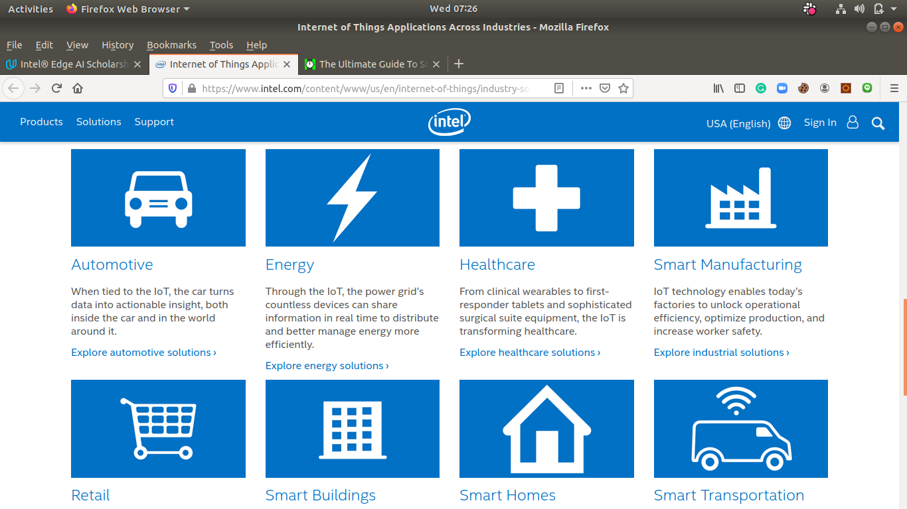 	
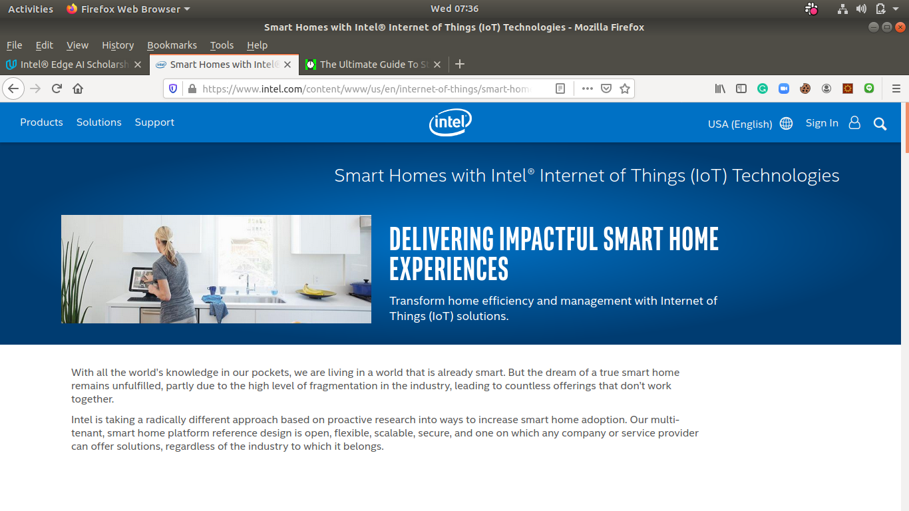 	
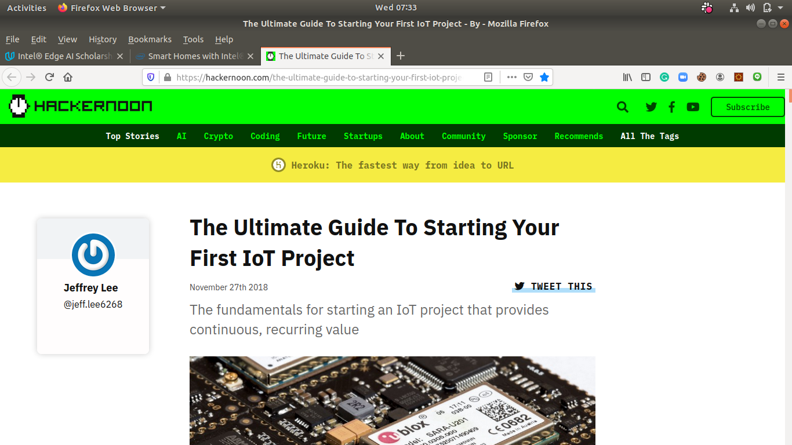 	

## Day 25: February 12th, 2020. #30DaysofUdacity
I am going through all references material present within course in deep.
- Further Researc and doing my hand dirty:
  - [**OpenVINO, OpenCV, and Movidius NCS on the Raspberry Pi**](https://www.intel.com/content/www/us/en/internet-of-things/industry-solutions.html)\
	I learn to utilize the OpenVINO toolkit with OpenCV for faster deep learning inference on the Raspberry Pi and is nice article.
  - Again study and started hand on with  Raspberry Pi with the help of [**The Ultimate Guide To Starting Your First IoT Project**](https://hackernoon.com/the-ultimate-guide-to-starting-your-first-iot-project-8b0644fbbe6d).
  
  - I will encourage awesome folks who are going great  
					@Akash Singh @Rohit.intelai @Shreya Chakrabarti
					@Shahnoza @Lesliel @Aarthi Alagammai @Anna Scott
					@arundhatee @Clinton B @Ahmed @Nikita 
					@Magda @Adriana Chen @EvanO @Hugo Oliveira
					@Neha Soni @Hein@realrajanpaudel
					@Juber Rahman @Bearbear@Tchouanga @Richárd Ádám Vécsey Dr.
                    @Asad Ur Rahman @Marco_ @Irina_Gr @Emeka @Boris @Filipe Queiroz 
                    @Anna Scott @María V @N. Hussain @nagendra_init @AndyP @Boris @Ankita Kesari@Nada Aweaa.
					@Fabrizio Cacicia @rodbelisario @kareem.h @Jorge Andrés Hernández Jara @Gustavo94 @Richárd Ádám Vécsey Dr.
					@Fernando Terrazas @HUY DUC VO @Juan Jose Moreno Guadamur @MODF @Faisal Raza Khan @Edna Sawe
					@Ife Ade @Filipe Queiroz  @Wonde @Richárd Ádám Vécsey Dr.@Deep Khurana @Bhuvaneswari @Odaliz Balcazar @davisclick 
					@Athanasios Alexopoulos @Atul Awasthi @Stanislav Ladyzhenskiy @Nikhil Tiwari @shahidaac @Edgardo Peregrino @Lakshya Malhotra
					@D.RICHARD @Muhammad Haris @Mfatikk @Sijoon Lee @Jorge Andrés Hernández Jara @Marcos Bellezi @Axel @Richárd Ádám Vécsey Dr. 
					@David Francisco Dávila Ortega @Fabrizio Cacicia @HUY DUC VO
					
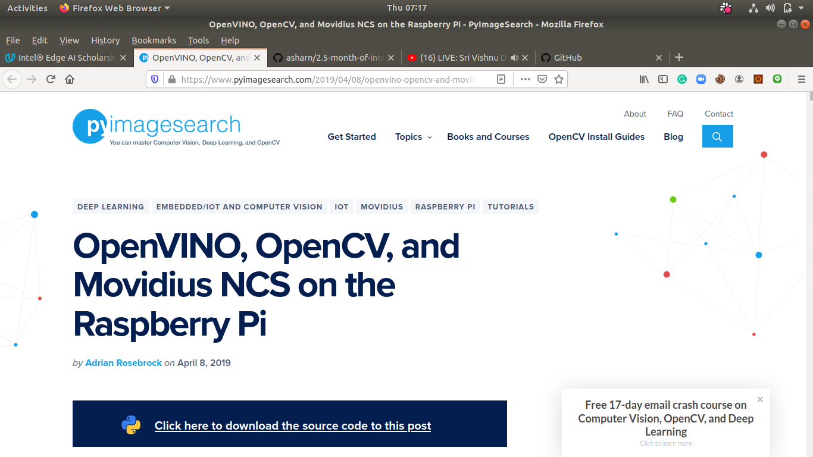 	
 	
 

## Day 26: February 13th, 2020. #30DaysofUdacity
I am going through all references material present within course in deep.
- Further Research:
  - [**What is the best programming language for Machine Learning?**](https://towardsdatascience.com/what-is-the-best-programming-language-for-machine-learning-a745c156d6b7)\
  - [**Optimization Guide**](https://docs.openvinotoolkit.org/latest/_docs_optimization_guide_dldt_optimization_guide.html).
  
  - I will encourage awesome folks who are going great  
					@Akash Singh @Rohit.intelai @Shreya Chakrabarti
					@Shahnoza @Lesliel @Aarthi Alagammai @Anna Scott
					@arundhatee @Clinton B @Ahmed @Nikita 
					@Magda @Adriana Chen @EvanO @Hugo Oliveira
					@Neha Soni @Hein@realrajanpaudel
					@Juber Rahman @Bearbear@Tchouanga @Richárd Ádám Vécsey Dr.
                    @Asad Ur Rahman @Marco_ @Irina_Gr @Emeka @Boris @Filipe Queiroz 
                    @Anna Scott @María V @N. Hussain @nagendra_init @AndyP @Boris @Ankita Kesari@Nada Aweaa.
					@Fabrizio Cacicia @rodbelisario @kareem.h @Jorge Andrés Hernández Jara @Gustavo94 @Richárd Ádám Vécsey Dr.
					@Fernando Terrazas @HUY DUC VO @Juan Jose Moreno Guadamur @MODF @Faisal Raza Khan @Edna Sawe
					@Ife Ade @Filipe Queiroz  @Wonde @Richárd Ádám Vécsey Dr.@Deep Khurana @Bhuvaneswari @Odaliz Balcazar @davisclick 
					@Athanasios Alexopoulos @Atul Awasthi @Stanislav Ladyzhenskiy @Nikhil Tiwari @shahidaac @Edgardo Peregrino @Lakshya Malhotra
					@D.RICHARD @Muhammad Haris @Mfatikk @Sijoon Lee @Jorge Andrés Hernández Jara @Marcos Bellezi @Axel @Richárd Ádám Vécsey Dr. 
					@David Francisco Dávila Ortega @Fabrizio Cacicia @HUY DUC VO @Hendrawan @Honoré @Nimisha Wagle @Mayur Kanojiya @A.Hamido
					@Lakshya Malhotra @Robotjelly
					
 	
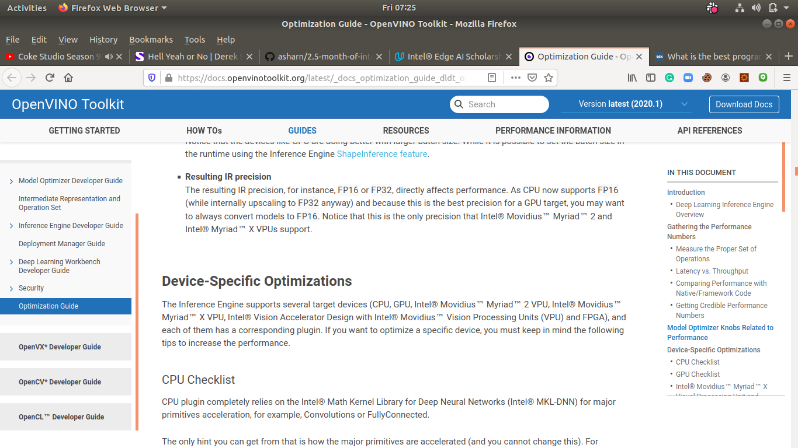 	

